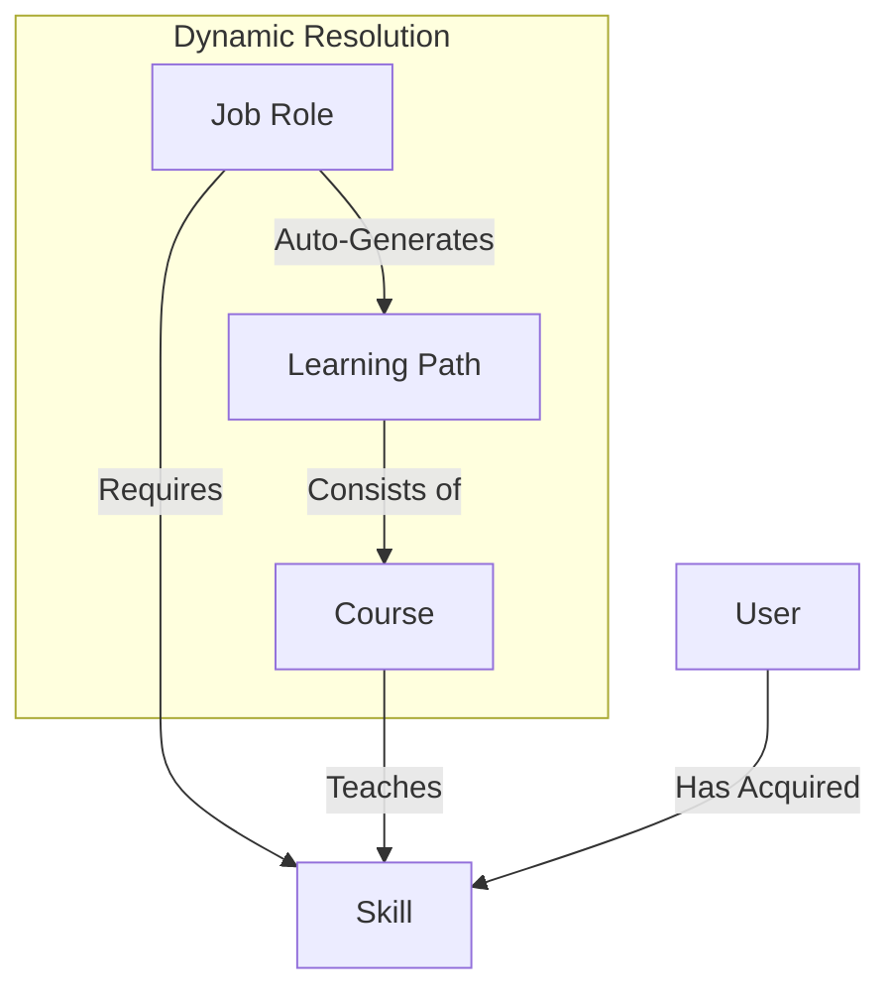

# Architecture: Roles, Skills, and Dynamic Learning Paths

## Overview

Moving beyond static course lists, the Learning Hub adopts a **Knowledge Graph** architecture. This connects users to their career goals through a dynamic chain of requirements and providers.



## Core Entities

### 1. Job Role (The Goal)
Represents a target career or position a user aspires to achieve.
- **Definition:** A named collection of required Skills.
- **Example:** "Senior Frontend Engineer"
- **Requirements:** `[React, TypeScript, System Design, CI/CD]`

### 2. Skill (The Currency)
The atomic unit of competence. This acts as the bridge between Roles and Courses.
- **Dual Nature:**
    - **Required By:** Roles (e.g., "Must know React")
    - **Provided By:** Courses (e.g., "Teaches React")

### 3. Course (The Provider)
Educational content that yields specific Skills upon completion.
- **Metadata:** Now includes a `skills` relation indicating what it teaches.
- **Example:** "Advanced React Patterns" provides `[React, Performance Optimization]`

---

## Dynamic Path Generation

The "Learning Path" is no longer a static database entry. It is a computed set of courses derived from a **Gap Analysis**.

### algorithm: `getLearningPath(userId, targetRoleId)`

1.  **Fetch Goal:** Get `requiredSkills` for `targetById`.
2.  **Fetch Inventory:** Get `acquiredSkills` for `userId`.
3.  **Calculate Gap:** `missingSkills = requiredSkills - acquiredSkills`.
4.  **Resolve Providers:**
    - Query the database for Courses that provide any of the `missingSkills`.
    - Rank/Sort courses (optionally by difficulty or dependency).
5.  **Output:** A personalized list of recommended courses.

### Benefits
- **Maintenance Free:** No need to update "Paths" when a new course is added. Just tag the course with "React", and it automatically appears in the path of anyone aiming for a Role that requires React.
- **Personalized:** A senior dev and a junior dev aiming for the same "Architect" role will see different paths because their starting `acquiredSkills` differ.

---

## Data Schema Updates

### Relations
- `JobRole` <-> `Skill` (Many-to-Many)
- `Course` <-> `Skill` (Many-to-Many)
- `User` <-> `Skill` (Many-to-Many, with `acquiredAt`)

### Prisma Schema (Conceptual)
```prisma
model JobRole {
  id          String @id
  skills      Skill[]
}

model Course {
  id          String @id
  skills      Skill[] // Skills taught by this course
}

model Skill {
  id          String @id
  roles       JobRole[]
  courses     Course[]
  users       UserSkill[]
}
```
